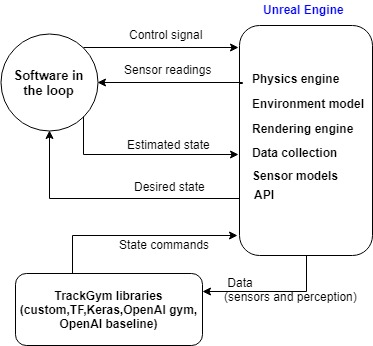
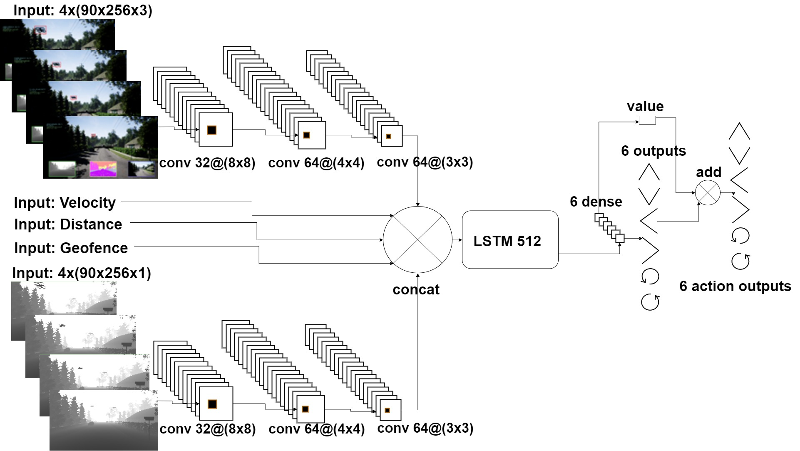

UAV NAVIGATION, TRACKING, AND INTERCEPTION USING DEEP REINFORCEMENT LEARNING 

We propose a self-supervised, model-free deep reinforcement learning architecture with cascade reward for unmanned aerial vehicle navigation and target interception
in a 3D environment. The first contribution of the dissertation solves the problem of partial observability when non-linear function approximators are used for learning
stochastic policies. The second contribution optimizes the problem of maximizing the total expected rewards. The third contribution trains the agent in a photo-realistic
environment with a real physics engine. To achieve these goals, a deep Q-network that combines double and dueling architectures is adopted as a value function approximator, 
and the prioritized experience replays the sample independent and identically distributed random variables from the experiences with the highest relevance to the interception 
and obstacle avoidance tasks. A new simulator is developed for training drones to track and intercept a target. We demonstrate that our approach achieves better results in 
learning policies compared to state-of-the-art deep Q-network algorithms.

NTRODUCTION
Reinforcement Learning (RL) is a field of artificial intelligence (AI) and offers promising technology for robotics because it mimics how intelligent life learns and evolves.
RL allows machine intelligence to increase because it does not rely on predetermined and preprogrammed instructions. With RL, we can directly observe the evolution of AI to be
useful in real-life applications. For example, OpenAi’s robotic arm evolved using RL to recognize colors and letters and manipulate objects. Such capabilities were deemed 
science fiction less than a decade ago. Although some principles and RL algorithms have existed for a few decades, the field remains in its infancy but is expanding. 
Only recently has the public began to hear about RL applications because it was previously computationally impractical. Emerging from the high demand for Graphical Processing Unit (GPU) 
compute power by gamers and cryptocurrency miners, advanced GPUs were developed and subsequently made available for training in Deep Reinforcement Learning (DRL) models.

PROPOSED APPROACH 

 

 RESULTS

